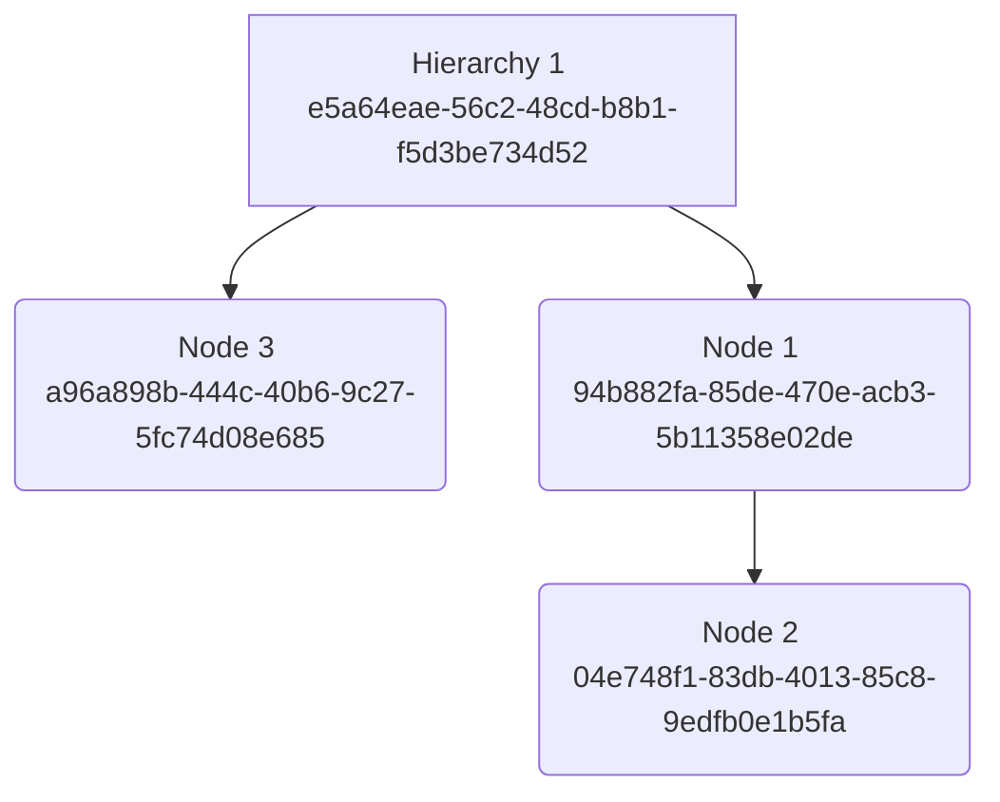

A catalog contains the products available for sale in your store. A catalog also contains information about how to organize those products for navigation menus and search facets in a shopper experience.

## Catalogs with Product Content Management and Price Books

When using the Product Content Management (PCM) feature, before you create a catalog you define the following resources:

- Hierarchies - hierarchies and nodes for all the ways that you can categorize the products
- Products - product information, associated assets, and links to hierarchy nodes
- Price Books - prices for the products associated with the hierarchies

A catalog is a combination of hierarchies and a price book. The hierarchies determine which products appear in the catalog, that is, only the products that are associated with the selected hierarchies are included in the catalog. The price book contains the prices for each of the products in the catalog.

Use catalog rules to schedule a catalog to appear during a particular date and time, such as a seasonal catalog. The catalog may have different pricing than the other catalogs. You can have multiple published catalogs.

When a catalog is ready to be used in a store, you publish it. You can create and publish catalogs for different contexts and channels. You retrieve catalogs for your shopper experience by using the Catalog View API.

Replace with current catalog concept page!

## Catalogs with v2 Product resources

While catalogs were designed for use with Product Content Management services, you can use the Catalog View API to retrieve v2 Product resources. For example, if you do not see a need to migrate `v2/products` to `pcm/products` resources, but you want to speed up requests for products, you can use the read-only Catalog View service to retrieve the products.

The returned products are in the form of the v2 Product object, which includes prices. The returned v2 Brands, Collections, and Categories are structured into separate hierarchies. For example, the v2 Brand resources appear in a single Brand hierarchy where the nodes have the same names as the Brand resources.

## Related concepts

- [Product Content Management](products-pcm.md)
- [PCM Products](products-pcm.md)
- [PCM Hierarchies](hierarchies.md)
- [PCM Price Books](price-books.md)
- [Catalog Rules](catalog-rules.md)

## APIs

- [Catalog View API](../api/pcm/catalogs/index.md)
- [PCM Price Books API](../api/pcm/pricebooks/index.md)
- [PCM Products API](../api/pcm/products/index.md)
- [PCM Hierarchies API](../api/pcm/hierarchies/index.md)
