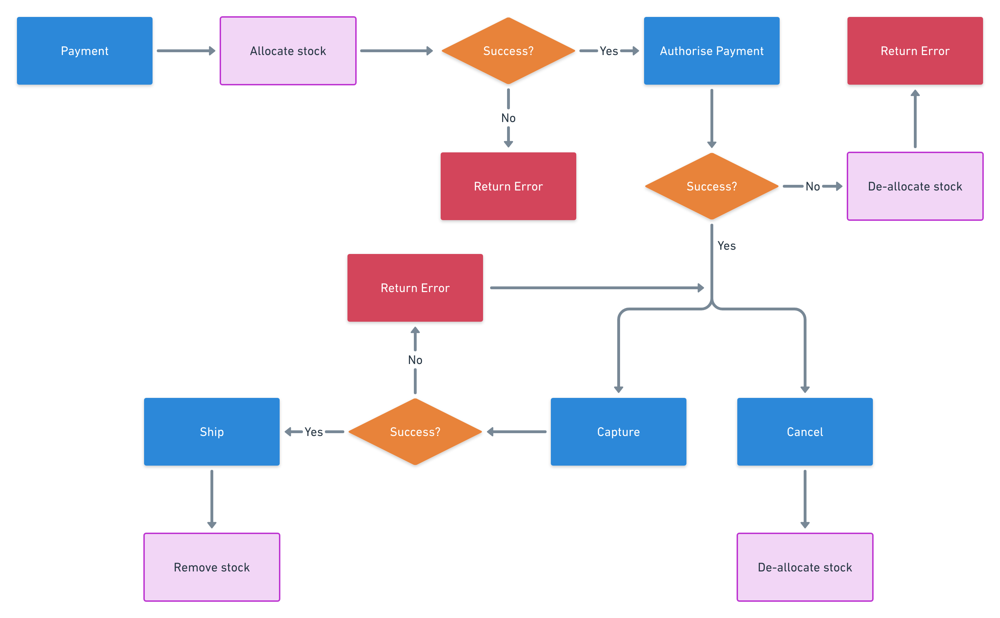

Inventory is the quantity of each product that you have in stock. The inventory service allows you and your business to keep track of inventory, including a transactional historic log.

Inventory for each product is tracked in terms of the following values:

- Total: The amount of product in stock. (Total = Available + Allocated)
- Available: The amount of product available in the stock minus allocated product. (Available = Total - Allocated)
- Allocated: The amount of reserved product in stock.

## Order flow

There are three mandatory steps to a complete an order in relation to inventory:

1. Added to a cart
2. Checked out
3. Paid
4. Shipped (optional)

### Unpaid order flow

The following flowchart depicts the process of an unpaid order.

```mermaid
graph DL
    A[Add Product to Cart] --> B{Enough Stock?}
    B -->|Yes| C[Checkout]
    B -->|No| D[Return Error]
    C --> E{Enough Stock?}
    E -->|Yes| F[Payment]
    E -->|No| G[Return Error]
```

### Payment flow

The following flowchart depicts the process of paying for an order.



## How stock is managed

When a customer attempts to add products to the cart, the inventory service checks if there is enough available stock. If there is not enough stock available at that time, you receive a 400 HTTP response with a warning. The response does not describe what products cannot be added, nor does it return how many are in stock at that time.

Should a customer be successful in adding products to a cart, because there is enough stock available, they can then check out, creating an unpaid order. When they attempt to checkout and create an unpaid order, a final check on available stock is done.

After the unpaid order has been created, payment can then be taken. As the customer attempts to pay for an order, the inventory service reserves the stock for the customer just before the payment is processed internally. Any time before this point of payment, a customer might lose their order, if they are slower than everyone else.

If the payment fails, the temporary stock allocation is removed, and the stock becomes available again for anyone to buy. If payment succeeds, that stock is still allocated, and the items are the customer’s, unless for any reason they are reallocated before shipment. For example, if the customer cancels, or you realize the order is fraudulent, you can reallocate the inventory. Finally, when the order is marked as shipped, that stock is finally fully decremented. That means the allocation number is reduced, and therefore the total, is no longer in the warehouse.

## Implications of the inventories flows

- It’s possible for more products to be in carts than there are in stock at that time.
- It’s possible for more products to be checked out than there are in stock at that time.
- It’s not possible for more stock to be paid for than is in stock at that time.
- It’s a race for your customers to pay for an order, and whoever doesn’t pay fast enough, is left disappointed.

## Related concepts

- [Orders](orders.md)
- [Payments](payments.md)
- [Checkout workflow](checkout-workflow.md)

## APIs

- [Inventory API](../api/inventory/index.md)
