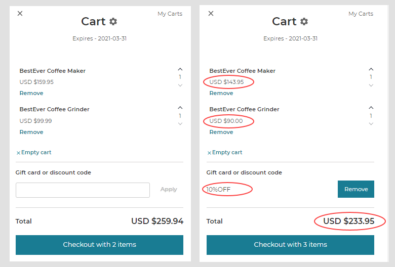

With promotions, you can provide different types of discounts to all your customers or specific customers. You can apply promotions automatically to all purchases, or you can create promotion codes that customers must enter to receive a discount.

You can have multiple promotions active at the same time. Promotions are active in a fixed duration, with defined start and end dates. However, you can manually stop a promotion at any time.

 Promotions can be:

- [Cart-level promotions](#cart-level-promotions): The promotion applies to the entire cart.
- [Item-level promotions](#item-level-promotions): The promotion applies individual items in a cart.

## Cart-level promotions

Cart-level promotions are applied to all items in the cart. Cart-level promotions include:

- **Fixed discount**: Reduces the product price by a fixed amount, such as $5.00 off.
- **Percentage discount**: Reduces the product price by a specific percentage, such as 10% off.

The following image shows a cart before and after applying a *10% Off* promotion. With the discount applied, the price for each item is reduced by 10% and the cart total reflects the reduction.

All items in the cart are eligible for cart-level promotions, even if they already have item-level promotions applied. You can select a few products and [exclude](../api/promotions/create-a-cart-fixed-discount-promotion.md) them from a cart-level promotion. However, the store that uses a [simple calculation method](../developer/how-to/calculate-totals.md#simple-calculation-method) does not support promotions with the `exclude` setting.

## Item-level promotions

Item-level promotions are applied to each item that qualifies for the promotion. In a shopping cart, the price of each item reflects the discount applied to each item. With the `max_applications_per_cart` setting, you can limit the number of purchases of an item at the sale price in a cart. For more information, see the [Promotions API](../api/promotions/index.md) section.

Item-level promotions include the following promotion types:

- **X for Y**: Offers bulk discount based on unit price, such as *2-for-1* sales.
- **X for amount**: Offers a bulk discount based on a fixed price, such as *3-for-$20* sales.
- **Bundle**: Offers bulk discount when selected products are purchased together. For example, *Buy any two items from the list for $100*.
- **Item fixed discount**: Reduces the price of multiple items by a fixed amount, such as *$5.00 off*.
- **Percentage item discount**: Reduces the product price for multiple items by a specific percentage, such as *10% off*. You can also count the number of usages of the promotion per SKU item and limit the usage of the promotion per item. For example, if the usage of the promotion is limited to ten and the shopper purchases two of the same item and three of the another item, five uses of the promotion is deducted from the total usage limit.
- **Free Gift**: Offers a free item when a specific product or a group of products are purchased.

:::important

- The maximum discount value setting specifies the maximum possible discount for the cart. To avoid the conflict with the promotions and the promotion to work, we recommend not to use this setting for the following promotions:

    - Cart-level fixed discount
    - Item fixed discount
    - X for Y discount
    - X for amount discount
    - Bundle
    - Free gift

- The maximum application per cart setting, which specifies the maximum number of applications of a promotion per cart, is applicable to line-item promotions only. For example, in a store that offers *buy SKU1 get a free gift* promotion with maximum application per cart set to one, the buyer can only use the free gift promotion once per cart. If maximum application per cart is not set, the buyer can use the promotion multiple times. You can also set maximum application per cart to zero to remove any usage limit.
- You can use the *exclude* setting to specify the products to be excluded from the cart-level promotions, such as *fixed discount* and *percentage discount*. However, the stores that use [simple calculation method](../api/advanced/settings/index.md#calculation-method) do not support excluding products from promotions.

:::

You can create codes for a promotion so that customers receive the discount only when the code is provided.

### Multiple promotions for the same SKU

You can have multiple promotions for the same SKU. However, each instance of the SKU in the cart is eligible for only one item-level promotion.

:::important
The promotions are applied in the order of date of creation of the promotions. The oldest promotion is applied first and the newest promotion is applied last. For each instance of a SKU that matches the criteria in the oldest promotion, the promotion is applied. For the remaining instances of the SKU, each instance is compared to the criteria for the next oldest promotion.
:::

For example, a cart consists of 1 *BestEver Coffee Maker* and 2 *BestEver Coffee Grinders*. The following promotions are available and applied automatically without a code:

- An existing *BestEver Coffee Maker + Grinder* bundle promotion for $200.00. The bundle discount is distributed among the items in the bundle depending on the price of each item.
- A newly added *BestEver Coffee Grinders 10% Off* percentage item discount promotion.

In this example, *BestEver Coffee Maker* costs $150 and *BestEver Coffee Grinder* costs $100. The promotions works in the following order:

1. The $50 bundle discount is distributed among the items depending on the cost. In this example, the cost proportion of products is 3:2 and the *BestEver Coffee Maker* gets $30 discount and *BestEver Coffee Grinder* gets $20 discount.
2. The second promotion is applied to the remaining *BestEver Coffee Grinders* item, and the price is reduced to $90.
3. The cart total after both discounts is $290 instead of $350.

## Promotion Codes

You can create codes for a promotion so that customers receive the discount when the code is provided. You can enable this feature by setting the `automatic` attribute to `false` in the promotions schema when you create a promotion. For more information, see the [Creating Promotion Codes](../api/promotions/create-promotion-codes.md) section.

With the `consume_unit` feature, you can limit the number of usages of a code for a promotion. You must create a code for this promotion to track the usage of the promotion. For example, in a store that offers 50% off on SKU1, but limits the maximum usage of the promotion to two, buyer can buy SKU1 twice for 50% discount. If buyer buys two SKU1s in a single purchase, the usage is two. For the third purchase, the promotion is not applied.

Promotion codes can be group codes or individual codes. For example, you can offer a seasonal discount to all customers, such as `SUMMER-SALE`, or you can offer preferred customers unique discount codes. Promotion codes expire automatically at the end of the promotion period and are removed from the promotion.

## Related Resources

### Concepts

- [Customers](customers.md)
- [Carts](carts.md)
- [Promotions - Commerce Manager](../dashboard/promotions/promotions.md)

### APIs

- [Promotions API](../api/promotions/index.md)

### How-to guides

- [Create and apply promotions](../developer/how-to/apply-promotions.md)
